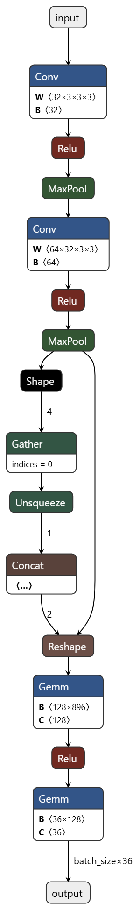

# Captcha-Reader

## Abstract

In this work, the author proposes two approaches to detect a specific type of CAPTCHA pattern, which can be summarized as:

- The number of characters remains the same each time.
- The font and spacing are consistent.
- The background and foreground colors and textures are largely unchanged.
- There is no skew in the structure of the characters.
- The CAPTCHA generator creates strictly 5-character captchas, with each character being either an uppercase letter (A-Z) or a numeral (0-9).

### Approach 1 (Neural)
In the first approach, the author trains a convolutional classification network based on PyTorch to classify the 36 characters (A-Z, 0-9). Due to the highly consistent pattern of the CAPTCHA, the use of RNNs for sequence recognition is avoided to reduce the computational complexity.

### Approach 2 (Simple)
In the second approach, the author employs an open-source Tesseract-based string recognition model. This method not only can efficiently recognize the CAPTCHAs in the current task but also provides sufficient ground truth data to finetune the model from Approach 1 in future tasks, enhancing the scalability of this work.


# Methods

## Neural Mode

### Problem Analysis
The author found that all input images share this characteristic, which can be represented by the following code:

```python
split_points = [4, 13, 22, 31, 40, 49]
char_images = [
    image.crop((split_points[i], 0, split_points[i + 1], image.size[1])) 
    for i in range(5)
]
```
By using this segmentation method, we can obtain individual character images, as shown below:
<p align="center"></p>

With this approach, we can use a single letter classification network to solve the problem, thereby saving computation resources.

### Dataset Processing
- The dataset is indivisible because only all 25 images in the dataset include all 36 characters.
- The test data uses a single image from the input ```input100.jpg```.
- Also, the ground truth is missing output21.txt, which was manually completed.

### Model Architecture
The model architecture is shown below:
<p align="center"></p>

## Simple Mode
Tesseract is an open-source Optical Character Recognition (OCR) engine maintained by Google, originally developed by Hewlett-Packard. It is capable of recognizing text in a wide variety of languages and can extract text from images. Tesseract can handle different types of documents, including scanned files, handwritten text, and text in photographs. Author uses pytesseract API to call its Captcha recognition model. 


# Getting Started
This work is based on Python3.  
## Neural Mode installation
```
pip install -r requirements_neural.txt
```

## Simple Mode installation
```
pip install -r requirements_simple.txt
```
Additional installation of library tesseract is required.  

### Linux
```
sudo apt-get update
sudo apt-get install tesseract-ocr
```

### macOS
```
brew install tesseract
```

### Windows
Please go to [Tesseract Installation](https://github.com/tesseract-ocr/tesseract) for installation.  
**⚠️ Notice:** Please don't forget to add the installation path into system env path.


# How To Run
## Neural Mode inference
```python
# no specification of saving path, result will be only printed on screen but won't be saved.
python demo.py sampleCaptchas/input/input00.jpg --model neural
# specification of saving path, result will be saved in the specific path.
python demo.py sampleCaptchas/test/input100.jpg --model neural --save 'sampleCaptchas/test/output.txt'
```

## Simple Mode inference
```python
# no specification of saving path, result will be only printed on screen but won't be saved.
python demo.py sampleCaptchas/input/input00.jpg --model simple
# specification of saving path, result will be saved in the specific path.
python demo.py sampleCaptchas/test/input100.jpg --model simple --save 'sampleCaptchas/test/output.txt'
```

## Others

### Training Neural Mode
```python
python train.py
```
### ONNX Export
```python
python model.py
```


# Things To Do
## Consturction of official testset
An official evaluation set should be built to verify the performance of existing models.
## Using RNN to improve the rubustness of the model.
We can use RNN in the convolution-based model to make sure it can also recognize other formats of Captcha.


# References
- [Tesseract](https://github.com/tesseract-ocr/tesseracts)
